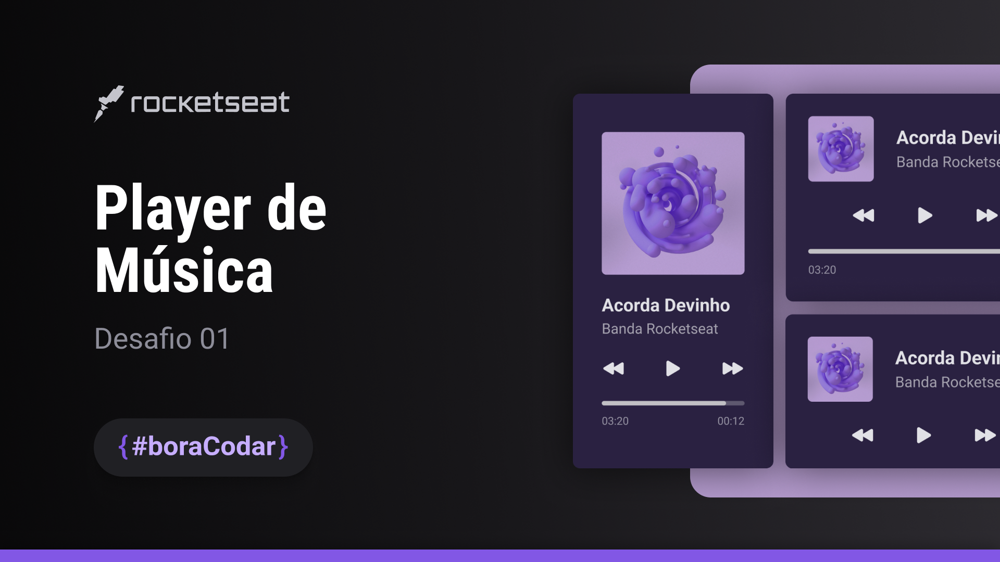

<h1 align="center"> Player de Música </h1>

O player de música é um componente para tocar áudios. Ele pode ser utilizado tanto em aplicações web quanto no mobile. Escute as melhores músicas da [Rocketseat](https://www.rocketseat.com.br/) em diferentes formatos de card player.

  <a href="#-deploy">Deploy</a>&nbsp;&nbsp;|&nbsp;&nbsp;
  <a href="#-layout">Layout</a>&nbsp;&nbsp;|&nbsp;&nbsp;
  <a href="#-tecnologias">Tecnologias</a>&nbsp;&nbsp;|&nbsp;&nbsp;
  <a href="#-licença">Licença</a>

  

  

## 🔗 Deploy

O deploy da aplicação pode ser acessada através do seguinte link: https://pabloxt14-music-player.vercel.app/

## 🎨 Layout

Você pode visualizar o layout do projeto através [DESSE LINK](https://www.figma.com/community/file/1195050524500542670). É necessário ter conta no [Figma](https://figma.com) para acessá-lo.

## 🚀 Tecnologias

Esse projeto foi desenvolvido com as seguintes tecnologias:

- TypeScript
- React (Vite)
- TailwindCSS
- React Icons

## 📝 Licença

Esse projeto está sob a licença MIT.

---

  Feito com 💙 por Pablo Alan

